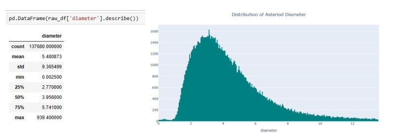

<h1>Asteriod Diameter Prediction</h1>

<h3>Predicting the diameters of asteroids using machine learning and astronomical data</h3>

You can view the live demo <a href="https://oyebamiji-micheal-asteroid-diameter-prediction-web-app.streamlit.app/">here.</a>

<h2>Table of Contents</h2>

- [Overview](#overview)
- [Objective](#objective)
- [Data](#data)
- [Insights from EDA](#insights)
- [Models and Evaluation Metrics](#model)
- [References](#references)

<h2>Project Overview</h2>

<a href="https://www.kaggle.com/datasets/basu369victor/prediction-of-asteroid-diameter" target="_blank">One of the intriguing challenges in the field of astronomy is the prediction of asteroid diameters</a>. Asteroids, celestial bodies orbiting the Sun, come in various shapes and sizes, making the estimation of their diameters a complex task. Over the years, numerous methods and approaches have been developed to tackle this challenge, each striving to outperform its predecessors. I have decided to step outside of my domain into the realm of asteroids, aiming to leverage the power of data-driven algorithms to predict their diameters accurately to a reasonable extent. In doing so, it not only contributes to the field of space science (lol) but also demonstrates the potential of machine learning in solving complex problems in alien domains.

<h2>Objective</h2>

The primary objective of this project is to address the challenging task of asteroid diameter prediction. This objective is pursued with a key intention of benchmarking against a prior work titled <a href="http://www.iraj.in/journal/journal_file/journal_pdf/12-555-156136953136-40.pdf">Prediction of Asteroid Diameter with the Help of Multi-Layer Perceptron Regressor</a> by Victor Basu. Basu's work encompasses the application of various machine learning algorithms, including XGBoost, Random Forest, ADA Boost and Multi-Layer Perceptron Regressor. Performance evaluation metrics such as mean absolute error, mean squared error, and R-squared score are used to assess the effectiveness of these models.

<h2>Data</h2>

While I have familiarized myself with the data description, it's worth noting that the column names may not immediately convey their meanings to anyone reading the notebook for the first time. To enhance clarity and facilitate a deeper understanding of the dataset, concise and informative summaries have been included for each column. This addition aims to provide a clearer overview of the dataset, ensuring that anyone can grasp the context and insights more readily.

<table>
  <tr>
    <th>Column Name</th>
    <th>Kaggle Description</th>
    <th>Additional Description</th>
  </tr>
  <tr>
    <td>full_name</td>
    <td>Object's full name/designation</td>
    <td>Contains the complete designation or name of celestial objects in the dataset, serving as a unique identifier.</td>
  </tr>
  <tr>
    <td>a</td>
    <td>Semi-major axis (au)</td>
    <td>Represents the size of the object's orbit around the Sun in astronomical units (au).</td>
  </tr>
  <tr>
    <td>albedo</td>
    <td>Geometric albedo</td>
    <td>Reflectivity of the object's surface, indicating how much sunlight it reflects.</td>
  </tr>
  <tr>
    <td>e</td>
    <td>Eccentricity</td>
    <td>Indicates how elliptical or circular the object's orbit is, with values close to 1 indicating high eccentricity.</td>
  </tr>
  <tr>
    <td>i</td>
    <td>Inclination (deg)</td>
    <td>Angle describing the tilt of the object's orbit relative to the solar system's plane.</td>
  </tr>
  <tr>
    <td>q</td>
    <td>Perihelion distance (au)</td>
    <td>Closest distance between the object and the Sun during its orbit, measured in astronomical units.</td>
  </tr>
  <tr>
    <td>ad</td>
    <td>Aphelion distance (au)</td>
    <td>Farthest distance between the object and the Sun during its orbit, measured in astronomical units.</td>
  </tr>
  <tr>
    <td>per_y</td>
    <td>Orbital period</td>
    <td>Time taken for the object to complete one orbit around the Sun, measured in years.</td>
  </tr>
  <tr>
    <td>data_arc</td>
    <td>Data arc-span (d)</td>
    <td>Duration over which observational data has been collected for the object, measured in days.</td>
  </tr>
  <tr>
    <td>condition_code</td>
    <td>Orbit condition code</td>
    <td>Code indicating the quality and reliability of the object's orbital data.</td>
  </tr>
  <tr>
    <td>n_obs_used</td>
    <td>Number of observations used</td>
    <td>Number of observational data points used to calculate the object's orbital parameters.</td>
  </tr>
  <tr>
    <td>H</td>
    <td>Absolute Magnitude parameter</td>
    <td>Measure of the object's intrinsic brightness or reflectivity, indicating its size and composition.</td>
  </tr>
  <tr>
    <td>diameter</td>
    <td>Diameter of asteroid (Km)</td>
    <td>Physical size of the asteroid, measured in kilometers.</td>
  </tr>
  <tr>
    <td>rot_per</td>
    <td>Rotation Period (h)</td>
    <td>Time taken for the object to complete one full rotation around its axis, measured in hours.</td>
  </tr>
  <tr>
    <td>neo</td>
    <td>Near Earth Object</td>
    <td>Indicates whether the object is classified as a Near Earth Object (NEO), with orbits in close proximity to Earth.</td>
  </tr>
  <tr>
    <td>pha</td>
    <td>Physically Hazardous Asteroid</td>
    <td>Identifies whether the object is classified as a Physically Hazardous Asteroid (PHA) with the potential to pose a physical threat to Earth.</td>
  </tr>
  <tr>
    <td>moid</td>
    <td>Earth Minimum orbit Intersection Distance (au)</td>
    <td>Quantifies the closest approach of the object's orbit to Earth's orbit, providing information about potential close encounters with our planet.</td>
  <tr>
    <td>...</td>
    <td>...</td>
    <td>...</td>
  </tr>
</table>
 
The full column description can be found in the <a href="https://github.com/Oyebamiji-Micheal/Asteriod-Diameter-Prediction/blob/main/asteriod_diameter_prediction.ipynb" style="text-decoration: None">notebook</a>.

<h2>Insights From EDA</h2>
The question of which feature(s) correlate with asteroid diameter and other related questions have I tried to answer while performing data visualization.

- 
It seems most asteroids have a diameter of 2km - 5km while others have up to 939km. In order to avoid a funny-looking plot due to the huge outlier, the data was capped using Tukey’s method before plotting.    Capping the data before plotting allows us to see the underlying distribution of the data - right-skewed (positively skewed). Rightly skewed here means that the majority of the data points are clustered on the left side of the distribution, and there are some larger values on the right side that are pulling the mean to the right.

- 
The semi-major axis of an asteroid is one-half of the major axis of the elliptical orbit. It is measured in astronomical units and describes an object's distance from the Sun. From the scatter plot below, the data points are concentrated in certain areas and all I see here is a weak correlation.   

- 
Another feature we can look at which perhaps provides us with an estimate of diameter is the Minimum orbit intersection distance (MOID). MOID is a measure used in astronomy to assess potential close approaches and collision risks between astronomical objects. It quantifies the closest approach of the object's orbit to Earth's orbit, providing information about potential close encounters with our planet.      What was observed here are three clear clusters with a somewhat linear trend between each cluster. Asteroids in the first cluster seem to have a relatively small diameter. Though we can roughly conclude that asteroids in the third cluster surely have a higher diameter, it is worth keeping into consideration that a lot of asteroids in the second cluster despite having a lower EMOID, have a significantly high diameter. My takeaway from here is probably taking advantage of clustering algorithms such as K-Means which can capture this relationship.    These insights demonstrate the advantage of doing EDA and not only looking at correlation coefficients or scatter matrix.

<h2>Model and Evaluation Metrics</h2>

The performance of all models used in the notebook is given below 
<table>
    <thead>
        <tr>
            <th>Model</th>
            <th>R2 Score</th>
            <th>Adjusted R2 Score</th>
            <th>RMSE</th>
            <th>MAE</th>
        </tr>
    </thead>
    <tbody>
        <tr>
            <td>Random Forest Regressor</td>
            <td>0.961945</td>
            <td>0.961905</td>
            <td>0.473486</td>
            <td>0.305354</td>
        </tr>
        <tr>
            <td>LightGBM Regressor</td>
            <td>0.961883</td>
            <td>0.961843</td>
            <td>0.473868</td>
            <td>0.310384</td>
        </tr>
        <tr>
            <td>XGBoost Regressor</td>
            <td>0.960489</td>
            <td>0.960447</td>
            <td>0.482460</td>
            <td>0.318531</td>
        </tr>
        <tr>
            <td>K-Nearest Neighbors</td>
            <td>0.861554</td>
            <td>0.861408</td>
            <td>0.903108</td>
            <td>0.623587</td>
        </tr>
        <tr>
            <td>Linear Regression</td>
            <td>0.830079</td>
            <td>0.829900</td>
            <td>1.000515</td>
            <td>0.713975</td>
        </tr>
        <tr>
            <td>Ridge Regression</td>
            <td>0.829130</td>
            <td>0.828949</td>
            <td>1.003305</td>
            <td>0.716889</td>
        </tr>
        <tr>
            <td>Elastic Net</td>
            <td>-0.000093</td>
            <td>-0.001148</td>
            <td>2.427280</td>
            <td>1.824157</td>
        </tr>
    </tbody>
</table>

In actuality, it is not feasible to directly compare my results to the one in the research paper since we do not use the same test set. However, when I compared various results from other people's notebooks on <a href="https://www.kaggle.com/datasets/basu369victor/prediction-of-asteroid-diameter/code" style="text-decoration: None">Kaggle</a>, I was able to achieve a better result just by doing a few data cleaning and feature engineering. I do not 100% trust these values though. Perhaps there are some columns in our training data which provide some think of info in the form of data leakage. Since I do not see anything related to this in the research paper, I have just simply gone with these values.    <strong>Kindly note that the above feature importances are from the random forest model and not lightgbm</strong>.

<h2>References</h2>

- [What is minimum orbit intersection distance (MOID)?](https://en.wikipedia.org/wiki/Minimum_orbit_intersection_distance)
- [Trajectory Browser User Guide - Nasa](https://trajbrowser.arc.nasa.gov/user_guide.php)
- [Semi Major and Semi Minor Axes - Wikipedia](https://en.wikipedia.org/wiki/Semi-major_and_semi-minor_axes)
